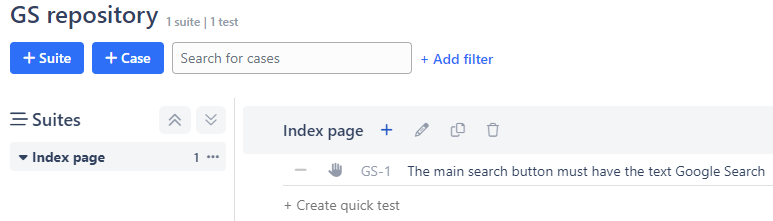
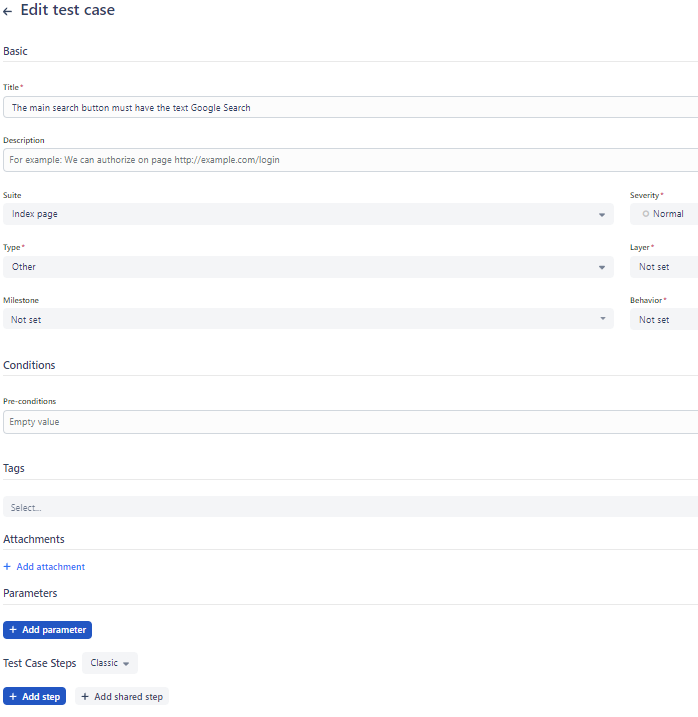
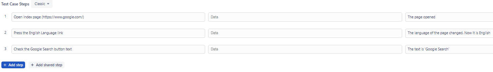
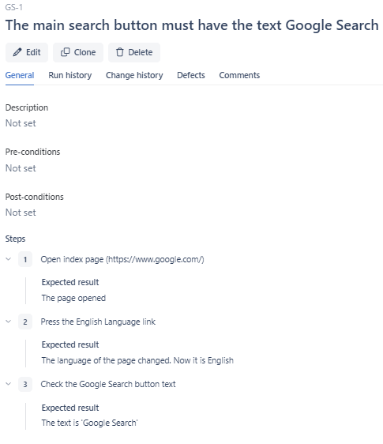
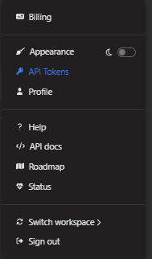
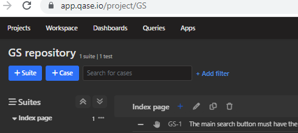
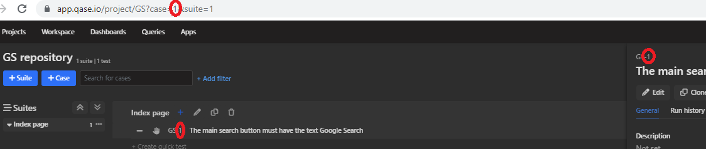
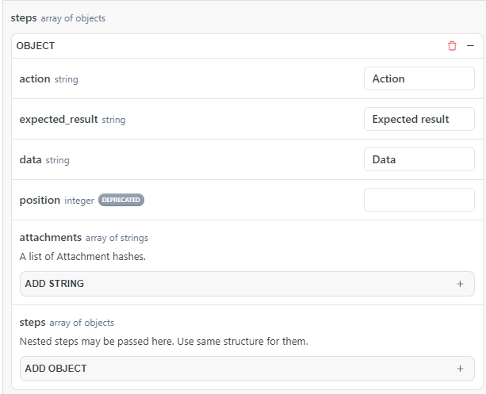
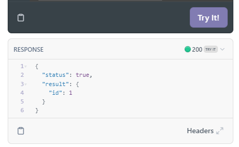
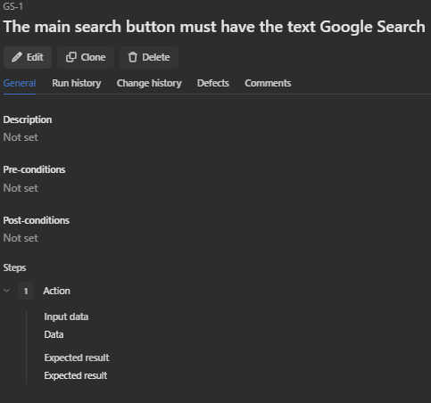

# pytest-playwright-next-iteration
## Next iteration of 1st created autotest repository

1st repository can be found here: [pytest-playwright](https://github.com/Lexxx42/pytest-playwright)

* Pytest comand to start tests:
```
pytest .
```

1. At the start of the code we have Qase repository



2. Open the test case



3. Let's create test case steps, which we already did with autotest



4. Save changes to the test case



5. In this project we will try to automate the process of filling/actualizing test's cases steps

6. We need to the integration with Qase.io with the open API
+ [API](https://developers.qase.io/reference/get-attachments)

7. To update the steps of the test case we need Update test case method
+ [Update test case](https://developers.qase.io/reference/update-case)

8. We need information
+ Token
+ Code for project
+ ID of the test case

9. To get your API token you need to click on your profile avatar and select API Tokens



10. Create .env file in your project root directory and add your API token.
+ Replace YOUR_API_TOKEN with your API token
```
TOKEN=YOUR_API_TOKEN
```

11. Project code can be found on the web page of the project



12. Test case ID can be found on web page when you open it



13. Fill the fields Header, code and id to test work of API

[Update test case](https://developers.qase.io/reference/update-case)

14. Add step to test case and fill the fields



15. All data ready to send. Click Try it! button and see response



16. If response code is 200, then data of our test case is changed




